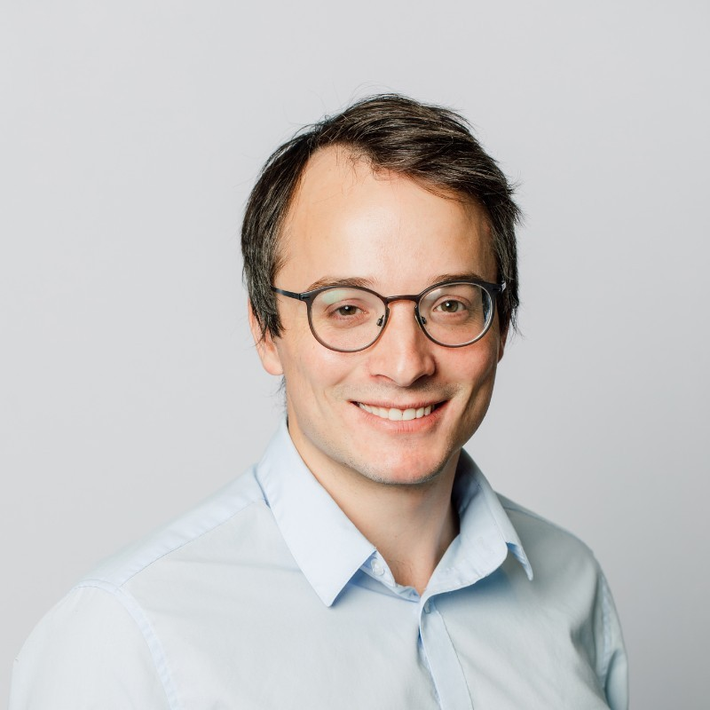

# About

# About the site

This is my blog where I'm going to drop notes on my personal & work life.

# About me

## Career

My background:

* I graduated from Queen's University with a B.A.Sc. in Chemical Engineering in 2016.
* I graduated from the University of Waterloo with a MASc. in Chemical Engineering in 2019.
* After graudating from Waterloo, I moved into a data science role at JANA Corporaton.
* After JANA, I joined [ACV Auto](https://acvauto.com/).

### ACV Auto
I joined ACV Auto in March 2022 working in the product analytics team as an analytics engineer.  AT ACV, I help the business make data driven decisions for improving products and moving the business forward.

### JANA Corporation
At JANA, I used data science, machine learning and reliability engineering to predict the risk of failure of the components of our client's installed natural gas transmission and distribution asset base.

### University of Waterloo

At the University of Waterloo, I primiarily worked on:

* Developing non-linear regression tools for estimating the reaction kinetic parameters of the catalysts we were studying in the lab.
* Designing and modelling a novel membrane reactor for CO2 methanation into renewable natural gas and assessing the feasibility of a renewable natural gas production facility.

My regression and modelling work has been used in 4 [publications](https://scholar.google.com/citations?user=J2R_w0UAAAAJ&hl=en).

I got interested in data science and machine learning while working on my Masters' Degree at the University of Waterloo.

## Personal

### Curling
In my spare time I like to curl competitively. Right now, I am apart of [Team Ferris](https://www.curlingzone.com/team.php?teamid=160858&profileid=31213) who competes on the World Curling Tour (WCT).

### Other Stuff
I like golfing, keeping in shape, cats & dogs and spending time with my loved ones. 

